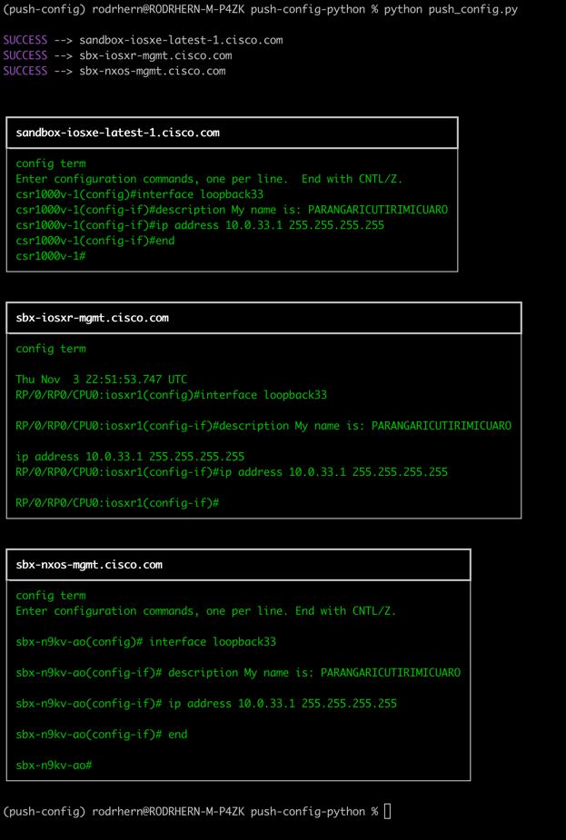

# Push Configuration using Python
Push standard configuration towards the Cisco Sandbox using Netmiko

## Pre-Requisites
You must have **Python3** and **pip3** installed. 
Once is done, clone this repository

## Install python dependencies
1. Open a CMD/Powershell/terminal console and move it folder `push-config-python`
2. Install the python dependencias that are in _requirements.txt_ file. You can use:
```
pip intall -r requirements.txt
```

## Running the script
1. Use the next command to run the script:
```
python push_config.py
```

